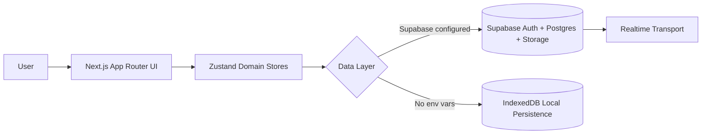

<div align="center">

# 🏋️ GymApplication

<p>
  <em>Train smarter. Track everything. Stay consistent.</em>
</p>

<p>
  <a href="https://gym-application-swart-three.vercel.app"></a>
  
  
  
  
</p>

<p>
  
  
  
  
  
  
</p>

<p>
  
  
  
  
  
</p>

<p>
  
</p>

</div>

---

## 1) Description

**GymApplication** is a modern, production-style fitness web app that combines workout planning, live session tracking, progress analytics, and body transformation journaling in one cohesive product.

It is designed around two execution modes:

- **Cloud mode** (Supabase configured): authentication + synced data + storage-backed photos.
- **Offline mode** (no Supabase env): local IndexedDB fallback for a no-friction demo and resilient usage.

This dual-mode architecture gives you an excellent developer experience while preserving real SaaS-grade foundations.

---

## 2) Live Demo

- **Production URL:** https://gym-application-swart-three.vercel.app

---

## 3) Features

- ✅ Dashboard with weekly progress, streaks, goals, and quick actions
- ✅ Workout planning and exercise programming
- ✅ Active workout session flow (sets, rest, timers, RPE, controls)
- ✅ Session history with progression insights
- ✅ Progress photos timeline + compare flow
- ✅ Body metrics and stats visualization (charts/cards)
- ✅ Auth + onboarding flow (when Supabase is configured)
- ✅ Offline-first fallback with IndexedDB persistence
- ✅ Theme support and polished component system
- ✅ Unit + integration + E2E testing stack

---

## 4) Screenshots

> Store README assets in: `public/readme/`

```text
public/
  readme/
    desktop-home-dark.png
    desktop-home-light.png
    mobile-home-dark.png
    dashboard-desktop.png
    workout-active.png
    auth-login.png
    analytics-stats.png
    responsive-layout.png
```

### Suggested image blocks


### Capture recommendations

- Desktop: **2880×1800** (rendered down by GitHub)
- Mobile: **1290×2796** (or simulator equivalent)
- Export both **dark** and **light** variants for hero screens
- Keep PNG assets under ~500KB with `oxipng`/`pngquant`

---

## 5) GIF Demo


### Recording + optimization workflow

- Record: **Screen Studio**, **Kap**, or **OBS**
- Convert: `ffmpeg` → `gifski`
- Target: 8–15 FPS, max width 1200px, each GIF ideally <8MB

---

## 6) Tech Stack

### Frontend

- Next.js 16 (App Router)
- React 19 + TypeScript 5
- Tailwind CSS 4 + shadcn-style UI patterns
- Framer Motion, Recharts, Swiper

### Data + Backend

- Supabase Auth (email sign-in/sign-up)
- Supabase Postgres (user-scoped app data)
- Supabase Storage (progress photos)
- IndexedDB fallback for local/offline mode

### State + Validation

- Zustand stores per domain
- React Hook Form + Zod schemas

### Quality + Tooling

- ESLint 9
- Vitest + Testing Library + jsdom
- Playwright E2E smoke suite

---

## 7) Architecture Overview



### Key architectural decisions

- **Domain-sliced features** (`features/*`) for scale and maintainability.
- **Store-per-concern strategy** (`store/*`) to isolate session, history, metrics, plan, profile, auth.
- **Polyglot persistence layer** (Supabase + IndexedDB adapters) for reliability and demoability.
- **Thin route pages, rich feature views** to keep App Router entry points clean.

---

## 8) Folder Structure

```text
app/                    # Next.js routes (auth + app shells)
features/               # Domain modules (dashboard, plan, stats, workout, photos)
components/             # Shared UI, layout, and primitives
store/                  # Zustand stores per business domain
lib/                    # Data adapters, utils, schemas, realtime, i18n
supabase/migrations/    # SQL schema and migration history
tests/ + e2e/           # Integration and end-to-end test suites
public/                 # Static assets and README media
```

---

## 9) Installation

```bash
git clone https://github.com/potocki92/GymApplication.git
cd GymApplication
npm install
```

---

## 10) Environment Variables

Create `.env.local`:

```bash
cp .env.example .env.local
```

```env
NEXT_PUBLIC_SUPABASE_URL=https://YOUR_PROJECT.supabase.co
NEXT_PUBLIC_SUPABASE_ANON_KEY=YOUR_SUPABASE_ANON_KEY
```

If env vars are omitted, the app still runs using local IndexedDB storage.

---

## 11) Running Locally

```bash
npm run dev
```

Open `http://localhost:3000`.

---

## 12) Production Build

```bash
npm run build
npm run start
```

---

## 13) Deployment

### Vercel (recommended)

```bash
vercel --prod
```

Deployment checklist:

- Add Supabase environment variables in project settings
- Ensure auth callback URL points to your deployment domain
- Validate route protection and storage permissions

---

## 14) API Integration

This project integrates with Supabase through focused adapters (`lib/supabase-*.ts`) rather than leaking API calls across UI components.

Benefits:

- centralized mapping between UI models and DB rows
- easier testing/mocking
- clear boundaries for future provider swaps

---

## 15) Authentication

- Supabase email auth (signup/login)
- server-side session updates through proxy middleware
- auth callback route for code exchange
- route groups split between `(auth)` and `(app)` experiences

---

## 16) Database Structure

Core entities include user-scoped records for:

- workouts + workout exercises
- workout sessions/history
- body metrics + goals
- progress photos metadata
- user profile/onboarding settings

Schema is versioned via `supabase/migrations/*`.

---

## 17) State Management

Zustand is used with **domain-specific stores** (history, plan, metrics, profile, workout session, etc.).

Why this pattern works:

- low boilerplate compared to reducers/context chains
- easy per-feature ownership
- straightforward async action composition

---

## 18) UI/UX Principles

- Mobile-first layout with desktop enhancement
- Action-driven dashboard UX
- Progressive disclosure in complex forms
- Fast feedback loops with toasts and optimistic interaction patterns
- Reusable atomic UI primitives for consistent spacing and rhythm

---

## 19) Performance Optimizations

- App Router route segmentation
- Feature-level composition to limit render scope
- Efficient chart rendering and memoized data transforms
- Local fallback path reduces backend dependency during development/demo
- Image processing pipeline for progress photos

---

## 20) Accessibility

- Semantic component structure via reusable primitives
- Keyboard-friendly controls and dialogs
- High-contrast-friendly visual language
- Focus on readable spacing and typographic hierarchy

---

## 21) Responsive Design

Support matrix:

| Viewport | Status |
|---|---|
| Mobile (≤640px) | ✅ Optimized |
| Tablet (641–1024px) | ✅ Optimized |
| Desktop (1025px+) | ✅ Optimized |
| Large displays | ✅ Adaptive layout |

---

## 22) Testing

```bash
npm test
npm run test:watch
npm run test:e2e
```

Current strategy:

- **Unit tests** for utility and mapping logic
- **Integration tests** for persistence/store behavior
- **E2E smoke tests** for route-level stability

---

## 23) Security

- Supabase-backed auth/session model
- user-scoped data access patterns
- route protection via server-side session middleware
- environment variable based secret handling

---

## 24) CI/CD

Recommended pipeline:

1. Install dependencies
2. Run lint + unit tests
3. Run build
4. Run Playwright smoke tests
5. Deploy preview
6. Promote to production

Example (GitHub Actions excerpt):

```yaml
name: ci
on: [push, pull_request]
jobs:
  verify:
    runs-on: ubuntu-latest
    steps:
      - uses: actions/checkout@v4
      - uses: actions/setup-node@v4
        with:
          node-version: 20
      - run: npm ci
      - run: npm run lint
      - run: npm test
      - run: npm run build
```

---

## 25) Roadmap

- [ ] Advanced training templates and block periodization
- [ ] Team/coaching mode with shared plans
- [ ] Wearable integrations (Apple Health / Google Fit)
- [ ] Nutrition + macro tracking module
- [ ] Deeper PR analytics and trend intelligence

---

## 26) Future Improvements

- API rate-aware sync queues for unstable networks
- server actions for selected write flows
- richer telemetry and product analytics instrumentation
- visual regression testing for core user journeys

---

## 27) Contributing

PRs are welcome and appreciated.

```bash
# 1) Fork repo
# 2) Create feature branch
git checkout -b feat/amazing-improvement

# 3) Commit
git commit -m "feat: add amazing improvement"

# 4) Push and open PR
git push origin feat/amazing-improvement
```

Please include:

- a concise problem statement
- screenshots/GIFs for UI changes
- test coverage for behavior changes

---

## 28) License

This project is licensed under the **MIT License**.

---

## 29) Author

**Patryk Potocki**

- GitHub: [@potocki92](https://github.com/potocki92)

---

## 30) Support

If this project helps you:

- ⭐ Star the repository
- 🍴 Fork it
- 🧠 Open feature requests/discussions
- 🤝 Contribute improvements

---

## 31) Acknowledgements

- Next.js, React, and Vercel ecosystems
- Supabase platform and OSS tools
- Radix UI and shadcn-inspired component patterns
- Open-source maintainers building world-class DX

---

<div align="center">
  Built with discipline, consistency, and progressive overload.
</div>
